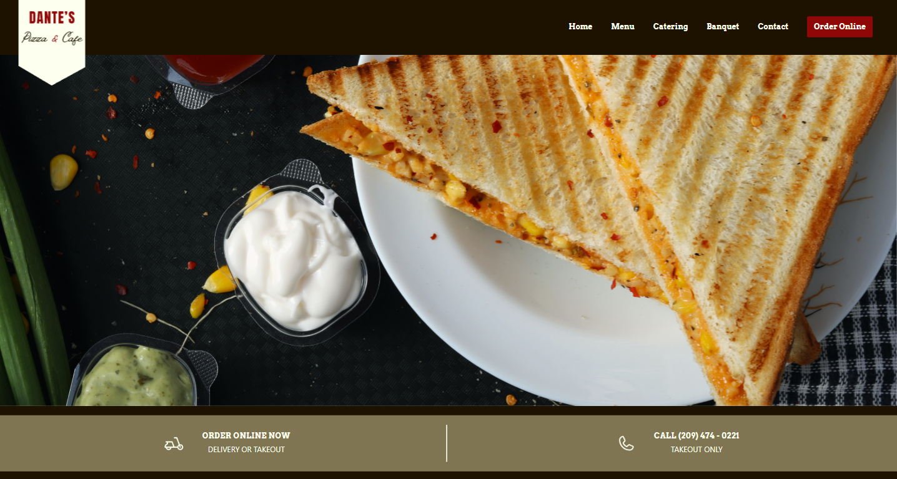
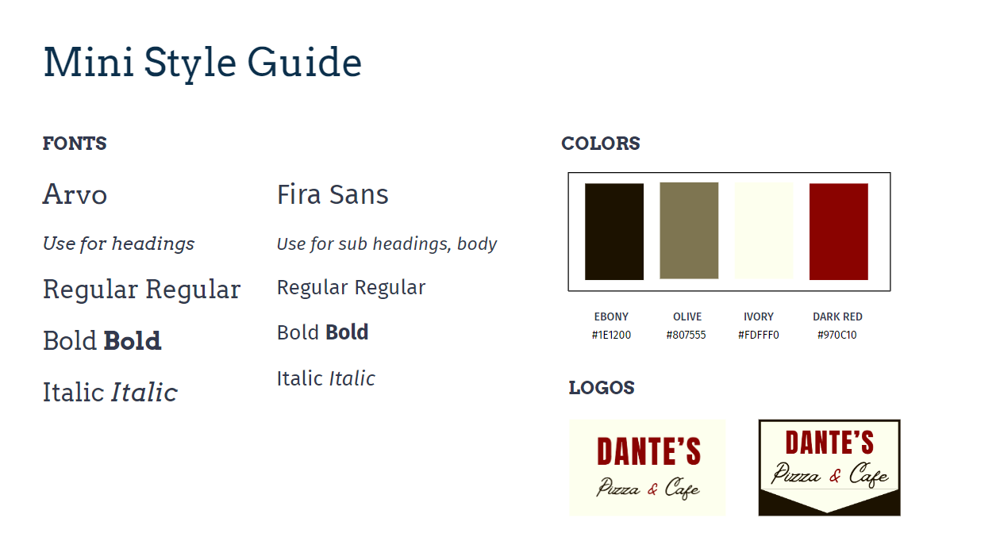

# Business Redesign  &emsp;&emsp;&emsp;&emsp;&emsp;&emsp;&emsp;&emsp;

**Project Team:** Elizabeth Trotter & Caleb Sylvia

**Project Scope:** This was a `partner project` where we `redesigned` the `existing website` of a `local business` in our community. The overall goal was to keep the personality from **Dantes Pizza & Cafe's** original design, but `optimize the website` to create a better `user experience`. Our design was `presented to a panel` of UI/UX, web, and business development specialists to obtain design critques prior to our project development start in Sprint Week 3.

## Peer Review
> **Name:** Zachary Dressel **Date/ Time:** 1/5/24 10:43 am
>
> **Comment(s):** Website is immaculate. Code of the page is nice and concise, and updated images from the first to the second prototype make for a better looking website. One change should be made, however, in that the spacing of the menu items needs to be fixed to reflect the prototype, and the spacing of certain sections, such as the hours of operation, need to shrinked in order to be viewed easier. Also, for a minor change, add the favicon to the browser tab.

**Issues Resolved:**
- Menu item spacing :white_check_mark: *1/5/24 11:30 am*
- Added favicon to browser tab :white_check_mark: *1/5/24 12:00 pm*
- Hours & operation spacing :white_check_mark: *1/5/24 3:00 pm*

---

## Timeline

| Sprint | Description | Tools |
| --- | --- | --- |
| **Week 1**   *5 days* | Design a fully responsive website for **Dante's Pizza & Cafe** | `Figma` | 
| **Week 2**   *5 days* | 1. Present the design among a panel of professionals   2. Incorporate design critques suggested by the panel | `Figma presentation`, `Microsoft PowerPoint` |
| **Week 3**   *3 days* | Develop the website based on the prototype designed | `vanilla JavaScript`, `HTML`, `CSS` |

Table 1: Project timeline work completed during 3 major sprints

> [!NOTE]
> Click [here](#development-version) to scroll down to view Dante's Pizza & Cafe's **version history**. 

---

## Website Preview

Figure 1: Snapshot of staging website for development

## Prototype

Click [Prototype V 2](https://www.figma.com/proto/IZ1IJ8tUWBsdXfP2lMetDl/Business-Redesign-Rework?type=design&node-id=1-605&t=6aVrKEGjnJBa0F2p-1&scaling=min-zoom&page-id=0%3A1&starting-point-node-id=1%3A605&mode=design) 
to visit the **final Figma prototype design**. Design critque from the panel presentation was incorporated into this version.
- *Notable features expanded to include updated contact form, additional icons, enhanced banner logo, & improved imagery.*

Click [Prototype V 1](https://www.figma.com/proto/WiIYdG8WmdJ8nkJv6AB7AS/Business-Redesign?node-id=12-26&starting-point-node-id=12%3A26&mode=design&t=jJQIUqZEqM7ryaoY-1)
to visit the first prototype iteration.
- *Notable features include new style guide, simplified color palette, added compatible font pairings, clean logo design, clear call to actions, improved user navigation, dedicated sections, clean layout & improved formatting.*

## Mini Style Guide

Figure 2: Mini style guide created during Wk 1 Sprint

---

## Development Version

**Version 2.1 (`V.2.1`)**

***Features:***
1. Intuitive navigation
2. Streamlined user experience
2. Well-organized category pages
2. Responsive mobile format
3. Exceeds Web Content Accessibility Guidelines 2.1

### Protoype Version

**Version 2 (`V.2`)**

***Features:***
1. Improved contact form
2. Additional icons
3. Enhanced eye-catching banner logo
4. Improved imagery
5. Spacing fixes

**Version 1 (`V.1`)**

***Features:***
1. Simplified color palette 
2. Compatible font pairings
3. New logo design
4. Clear call to actions 
5. Improved user navigation 
6. Dedicated sections
7. Improved data presentation
8. Clean layout & improved formatting
9. Fully responsive for all formats
